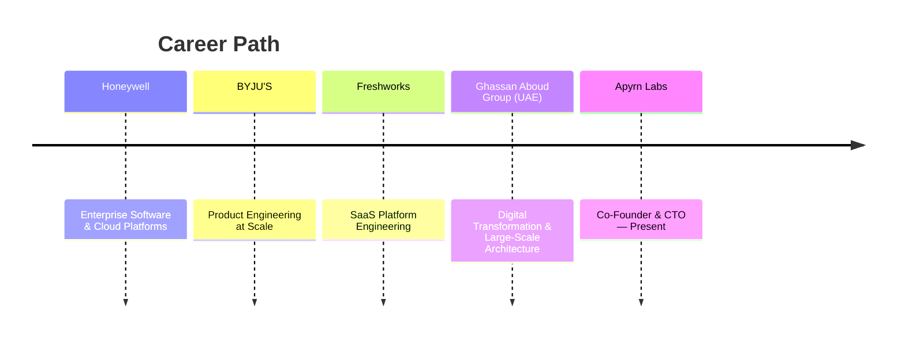

<div align="center">


<br/>

[](https://apyrn.com)

<br/>

<a href="https://apyrn.com"></a>
<a href="https://www.linkedin.com/in/rurajavel"></a>
<a href="mailto:raja@apyrn.com"></a>

</div>

<br/>

## About

I'm Raja — Co-Founder & CTO at **Apyrn Labs**, based in India. I design and build enterprise integration platforms, canonical data models, and AI agent infrastructure for organizations that need their systems to talk to each other reliably.

My work sits at the intersection of **enterprise software architecture** and **applied AI** — turning fragmented business APIs into coherent, governed, AI-ready platforms.

```txt
const focus = {
  building: ["Enterprise Platforms", "AI-native Systems", "Integration Platforms", "Developer Infrastructure"],
  obsessedWith: ["Reliability", "Canonical Data Models", "API Design", "Agent Security"],
  currentlyExploring: ["MCP", "LLM Orchestration", "Event-Driven Architecture"],
};
```

<br/>

## What I'm Building — The Apyrn Ecosystem

<table>
<tr>
<td width="50%" valign="top">

### 🏛️ Apyrn Platform
**Enterprise integration & AI enablement**

Canonical data models and composite APIs that unify enterprise systems:

- Enterprise Integrations
- Business APIs & Composite APIs
- Customer360 · Vendor360
- Inventory360 · Product360 · Order360
- Enterprise AI Enablement

</td>
<td width="50%" valign="top">

### 🛠️ Apyrn Forge
**OpenAPI → SDK → MCP, automated**

Turns existing API contracts into modern, agent-ready interfaces:

- SDK Generation
- MCP Server Generation
- OpenAPI Automation
- API Modernization

</td>
</tr>
<tr>
<td width="50%" valign="top">

### 🔁 Apyrn Relay
**Enterprise webhook reliability**

Delivery infrastructure built for systems that can't afford to miss an event:

- Retry & Replay
- Delivery Monitoring
- Signature Verification
- Operator Console

</td>
<td width="50%" valign="top">

### 🔐 Apyrn Vault
**AI agent security**

Security tooling for the agentic layer of the enterprise stack:

- Credential Monitoring
- OAuth Health Checks
- Secret Detection
- MCP Security

</td>
</tr>
</table>

<br/>

## Career Journey



<details>
<summary><b>Exposure & domains across this journey</b></summary>
<br/>

- Enterprise Software delivery at organizational scale
- Cloud Platforms — AWS & Azure production environments
- Product Engineering across high-growth SaaS orgs
- Digital Transformation initiatives
- Large-Scale Architecture and systems design

</details>

<br/>

## Areas of Interest

<div align="center">

`Enterprise Architecture` `Distributed Systems` `Microservices` `Event-Driven Systems`
`AI Engineering` `LLMs` `MCP` `Developer Platforms`
`Business APIs` `Integration Platforms` `Platform Engineering`
`Enterprise Security` `Cloud Infrastructure`

</div>

<br/>

## Tech Stack

<table>
<tr>
<td valign="top" width="25%">

**Backend**


</td>
<td valign="top" width="25%">

**Frontend**


</td>
<td valign="top" width="25%">

**Data**


</td>
<td valign="top" width="25%">

**Cloud & AI**


</td>
</tr>
</table>

<br/>

## Roadmap

- [ ] 🚀 AI-native Enterprise Platform
- [ ] 🚀 Developer Infrastructure for API-first teams
- [ ] 🚀 Enterprise-grade Composite APIs
- [ ] 🚀 AI Agent Platforms with governed security
- [ ] 🚀 Integration Reliability at scale

<br/>

## GitHub Activity

<div align="center">


<br/>


<br/>


</div>

<br/>

## Connect

<div align="center">

<a href="https://apyrn.com"></a>
<a href="https://www.linkedin.com/in/rurajavel"></a>
<a href="mailto:raja@apyrn.com"></a>

<br/><br/>

<sub>Building the connective tissue between enterprise systems and AI agents — one API at a time.</sub>

</div>


